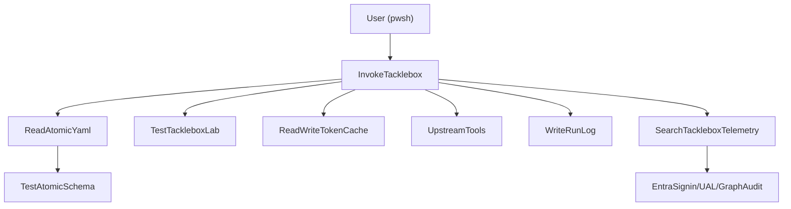

# Tacklebox v1 Harness & Atomics Plan

## Overview

Tacklebox already has a solid Phase 0 skeleton: module load order, lab-tenant guard, config and token cache I/O, run-log wiring, dependency manifests, and JSON Schemas for atomics and rigs. This plan describes how to grow that skeleton into a v1-ready harness in phased increments, starting with a single end-to-end auth atomic and telemetry validation, then expanding to the full v1 atomic and rig inventory while respecting the wrap-don’t-write and lab-only constraints.

## Current repo state (Phase 0 skeleton)

- **Module shell**
  - `Tacklebox.psd1` exports the public surface: `Invoke-Tacklebox`, `Invoke-TackleboxRig`, `Get-Tackle`, `Get-TackleboxRig`, `Search-TackleboxTelemetry`, `Test-TackleboxLab`, `Get-TackleboxCoverage`, `Install-TackleboxDependencies`.
  - `Tacklebox.psm1` sets `$script:TackleboxModuleRoot` / `$script:TackleboxConfigRoot`, ensures runtime directories (tokens, runs, tools, logs), dot-sources `lib/classes`, `lib/private`, `lib/public`, and runs the lab-tenant guard via `Test-TackleboxLab -PassThru` at module load.
- **Private helpers (already implemented)**
  - `[lib/private/Read-AtomicYaml.ps1](lib/private/Read-AtomicYaml.ps1)` parses a single atomic YAML file (using `powershell-yaml`).
  - `[lib/private/Test-AtomicSchema.ps1](lib/private/Test-AtomicSchema.ps1)` validates parsed atomics against `[schema/tacklebox-atomic.schema.json](schema/tacklebox-atomic.schema.json)` and enforces per-file `auto_generated_guid` uniqueness.
  - `[lib/private/Read-TackleboxConfig.ps1](lib/private/Read-TackleboxConfig.ps1)` loads `~/.tacklebox/config.json` (or `$TACKLEBOX_HOME/config.json`).
  - `[lib/private/Read-TokenCache.ps1](lib/private/Read-TokenCache.ps1)` / `[lib/private/Write-TokenCache.ps1](lib/private/Write-TokenCache.ps1)` implement a roadtools-compatible token cache, plus `Remove-TackleboxTokenCache` for cleanup.
  - `[lib/private/Write-RunLog.ps1](lib/private/Write-RunLog.ps1)` and `Get-RunLog` manage JSONL run logs under `~/.tacklebox/runs/<RunId>.jsonl`.
- **Public cmdlets (mix of real and stubs)**
  - `[lib/public/Get-Tackle.ps1](lib/public/Get-Tackle.ps1)` enumerates atomics under `atomics/<id>/<id>.yaml` and returns a per-test summary; in Phase 0 it simply returns an empty array.
  - `[lib/public/Get-TackleboxRig.ps1](lib/public/Get-TackleboxRig.ps1)` enumerates rig YAMLs under `rigs/*.yaml`; also returns empty in Phase 0.
  - `[lib/public/Test-TackleboxLab.ps1](lib/public/Test-TackleboxLab.ps1)` implements the lab-tenant guard, keyed off config `lab_allow_list` / `lab_pattern_regex` and the `TACKLEBOX_LAB_OVERRIDE` environment variable.
  - `[lib/public/Install-TackleboxDependencies.ps1](lib/public/Install-TackleboxDependencies.ps1)` provisions pinned upstream tools using `[dependencies/PINNED-VERSIONS.md](dependencies/PINNED-VERSIONS.md)` and manifests under `dependencies/manifests/*.json`.
  - `[lib/public/Invoke-Tacklebox.ps1](lib/public/Invoke-Tacklebox.ps1)`, `[lib/public/Search-TackleboxTelemetry.ps1](lib/public/Search-TackleboxTelemetry.ps1)`, `[lib/public/Invoke-TackleboxRig.ps1](lib/public/Invoke-TackleboxRig.ps1)`, `[lib/public/Get-TackleboxCoverage.ps1](lib/public/Get-TackleboxCoverage.ps1)` are Phase 0 stubs that throw with phase pointers.
- **Schemas and CI wiring**
  - `[schema/tacklebox-atomic.schema.json](schema/tacklebox-atomic.schema.json)` and `[schema/tacklebox-rig.schema.json](schema/tacklebox-rig.schema.json)` define the extended ART atomic schema (with `auth_profile`, `defense_evasion`, `requires_token`, `expected_telemetry`, `exercises_chokepoint`) and the rig schema (`rig`, `ua_profile`, `egress_profile`, `steps[]` with `requires_token_from`).
  - `.github/workflows/ci.yml` runs PSScriptAnalyzer and the Pester unit suite under `tests/unit`, plus a module-load smoke test.
  - `.github/workflows/lint-yaml.yml` validates any `atomics/*/*.yaml` and `rigs/*.yaml` against the JSON Schemas using ajv-cli and js-yaml.
- **Tests**
  - `tests/unit/lab-tenant-guard.tests.ps1`, `tests/unit/token-cache.tests.ps1`, `tests/unit/run-log.tests.ps1`, and `tests/unit/schema-parser.tests.ps1` exercise the lab guard, token cache I/O, run-log behavior, and schema validation helpers.

## Architecture at a glance

A single-atomic run flows through existing primitives like this:

Rigs later become a thin orchestrator over `Invoke-Tacklebox`, sharing a `RunId` and token-state between steps while layering UA and egress profiles.

## Phase 1 – Harness gate (first auth atomic + telemetry search)

**Goal:** Move from a pure skeleton to one fully functional auth atomic with `-DryRun`, `-Cast`, and `-Validate` wired end-to-end, using pinned upstream tools and actually confirming telemetry in Entra signin logs / UAL.

- **1. Author the first auth atomic YAML**
  - Create an `atomics/` directory and add a first auth atomic, e.g. a device code phishing or other clearly lab-safe auth scenario, under a path like `[atomics/T1078.004-device-code/T1078.004-device-code.yaml](atomics/T1078.004-device-code/T1078.004-device-code.yaml)`.
  - Conform to `[schema/tacklebox-atomic.schema.json](schema/tacklebox-atomic.schema.json)` and ART compatibility:
    - Set `attack_technique`, `display_name`, and at least one `atomic_tests[]` entry with `name`, `auto_generated_guid`, `supported_platforms`, `input_arguments`, `executor`, and optional `cleanup_command` / `references`.
    - Populate the five extension fields for each test:
      - `auth_profile` – clear label for the specific Entra sign-in pattern this auth flow should produce.
      - `defense_evasion` – how this atomic exercises MFA/CA bypass mechanics.
      - `requires_token` – either `true/false` or an object like `{ from: "device-code", resource: "https://graph.microsoft.com" }` describing the token dependency.
      - `expected_telemetry[]` – one or more entries with `source` (`entra_signin`, `ual`, `graph_audit`, `exo_audit`), `match` (field/value constraints), and an optional `within_minutes` budget.
      - `exercises_chokepoint` – object with `id` (Detection Chokepoints ID) and optional `url` back to the theory.
  - Ensure the new YAML passes the ajv-based schema validation in `lint-yaml.yml` and the runtime `Test-AtomicSchema` helper.

- **2. Implement `Invoke-Tacklebox` as the canonical single-atomic runner**
  - In `[lib/public/Invoke-Tacklebox.ps1](lib/public/Invoke-Tacklebox.ps1)`, replace the stub with a full implementation while preserving the existing parameter set names (`DryRun`, `Cast`, `Validate`) and parameters (`Atomic`, `TestName`, `InputArgs`, `TokenCacheKey`, `RunId`).
  - **Atomic discovery and selection**:
    - Resolve `$Atomic` into a single `atomics/<id>/<id>.yaml` path under the module root; fail with a clear error if multiple matches or no matches are found.
    - Use `Read-AtomicYaml` and `Test-AtomicSchema` to load and validate the atomic before any network or tenant interactions.
    - Select the target `atomic_tests[]` entry based on `-TestName` (or default to the only test when there is exactly one).
  - **Parameter binding and input argument handling**:
    - Map the hashtable passed via `-InputArgs` onto the `input_arguments` keys in the selected atomic test, applying defaults from the schema when keys are omitted.
    - Perform basic validation (required arguments present, types roughly match) and construct a final argument bag for the executor.
  - **Lab-tenant enforcement for Cast/Validate**:
    - For `-Cast` and `-Validate`, call `Test-TackleboxLab -PassThru` and enforce:
      - Refuse to proceed (throw) if `IsLab` is `$false` and `OverrideActive` is `$false`.
      - If `OverrideActive` is `$true`, require a new `-ConfirmOverride` switch on `Invoke-Tacklebox` to actually proceed, and include the guard’s `WarningMessage` in the thrown error when `-ConfirmOverride` is missing.
  - **Token state resolution and cache I/O**:
    - Interpret the atomic’s `requires_token` field and/or the `-TokenCacheKey` parameter to decide whether a pre-existing token is required, and for which resource.
    - Use `Read-TokenCache` to attempt to load an appropriate token; if missing/expired, delegate to the appropriate wrapped tool per `auth_profile` (e.g., roadtx or Microsoft.Graph) to obtain a token, then persist it via `Write-TokenCache` with a cache key of the form `{tenant}_{upn}_{client}`.
    - Keep the token-handling logic thin and declarative so that most behavior is driven by the atomic definition plus a small mapping table from `auth_profile` to upstream executor.
  - **Subprocess execution and run logging**:
    - Generate a `RunId` (GUID) when one is not supplied and consistently reuse it for all events in this cmdlet invocation.
    - For `-Cast` and `-Validate`:
      - Emit a `cast-start` event via `Write-RunLog` with the `RunId`, `Atomic`, and an event payload summarizing the auth profile, defense evasion profile, and input arguments used (scrubbed of secrets where appropriate).
      - Invoke the underlying tool/command described by the `executor` block, using the resolved input arguments and token.
      - Emit a `cast-end` event including status, duration, and any surfaced error details.
    - For `-DryRun`, log a lightweight `info` event indicating that this was a dry run and avoid any network or token-state side effects.
  - **Validate mode integration**:
    - For `-Validate`, after `cast-end`, call `Search-TackleboxTelemetry -RunId <RunId>` with a reasonable default `-WaitMinutes` based on the maximum `within_minutes` across the test’s `expected_telemetry` entries.
    - Aggregate the telemetry hits/misses into a structured result object and log `telemetry-hit` / `telemetry-miss` events via `Write-RunLog` for each expectation.
  - **Return value design**:
    - Ensure `Invoke-Tacklebox` returns a structured object (or objects) summarizing the mode (`DryRun` | `Cast` | `Validate`), `RunId`, atomic id, auth/defense profile, and telemetry results, so higher-level tools (including rigs and coverage reporting) can consume it easily.

- **3. Implement `Search-TackleboxTelemetry` against Entra and UAL**
  - In `[lib/public/Search-TackleboxTelemetry.ps1](lib/public/Search-TackleboxTelemetry.ps1)`, replace the stub with a real implementation that:
    - Accepts `RunId`, optional `WaitMinutes`, and `Source` (`entra_signin`, `ual`, `graph_audit`, `exo_audit`, `all`).
    - Reads the run log via `Get-RunLog -RunId` to recover the atomic id and any serialized expectations (e.g., copy `expected_telemetry` into the `data` payload of `cast-start` or a dedicated `validate-start` event).
    - For each `expected_telemetry` entry, issues the corresponding query:
      - `entra_signin`: use Microsoft.Graph (per its manifest) to query sign-in logs filtered by tenant, principal, app id, and other match criteria.
      - `ual`: use ExchangeOnlineManagement to query Unified Audit Log events filtered by operations, mailbox, etc.
      - `graph_audit` / `exo_audit`: use the appropriate audit log endpoints once pinned.
    - Implements a simple polling/wait loop honoring `WaitMinutes` and each expectation’s `within_minutes` field.
    - Returns a per-expectation result with fields like `Source`, `Matched`, `MatchedEvent` (or `null`), and `Expectation`.
  - Optionally extend `Write-RunLog` usage here to append `telemetry-hit` and `telemetry-miss` events as expectations are checked.

- **4. Harden and test the Phase 1 harness**
  - Add new Pester tests under `tests/unit` (and optionally a separate `tests/integration` folder) that:
    - Exercise the argument binding and schema validation behavior of `Invoke-Tacklebox` without making real network calls (e.g., by injecting fake atomics under a temporary `atomics/` root and stubbing the actual executor call path).
    - Validate that `-DryRun` never touches token cache or `Test-TackleboxLab` and that `-Cast`/`-Validate` refuse when `Test-TackleboxLab` reports `IsLab = $false` and no override is active.
    - Smoke-test the overall `Search-TackleboxTelemetry` API shape, even if full live-tenant integration tests are deferred.
  - Ensure CI still passes on all three OSes and that the new YAML passes `lint-yaml.yml`.

## Phase 2 – Expand auth and defense-evasion atomics (wrap-only)

**Goal:** Build out the rest of the v1 auth and defense-evasion inventory as YAML-only “tackle” on top of the Phase 1 harness, wrapping existing tools wherever possible.

- **1. Model remaining auth atomics in `atomics/`**
  - Add YAML definitions for the remaining auth patterns described in the primer (cookie replay, indirect proxy, OAuth consent grant, etc.), following the same folder convention (`atomics/<id>/<id>.yaml`) and schema fields.
  - For each, clearly set `auth_profile` and `requires_token` so that `Invoke-Tacklebox` can resolve token state consistently.
  - For cookie-replay and indirect-proxy variants, encode the underlying execution path as a wrapped call into roadtx/roadtools or GraphRunner rather than custom HTTP clients (except where explicitly allowed as a custom primitive).

- **2. Model defense-evasion atomics**
  - Author YAMLs for the eight defense-evasion scenarios described in the primer (refresh-token swap, Token Protection evasion, ROPC legacy auth, suspicious UA sign-in, CA gap auth, residential-proxy cookie replay, device registration/PRT, Auth Broker abuse).
  - Use `defense_evasion` to classify each test and `expected_telemetry` to encode the chokepoint expectations (e.g., Token Protection failures, SignIn risk signals, anomalous device-registration events).
  - Where an atomic wraps an upstream tool (TokenTacticsV2, AADInternals, GraphRunner, Microsoft.Graph, ExchangeOnlineManagement), ensure the executor `command` and arguments map cleanly to those tools’ CLIs or cmdlets according to the pinned versions and manifests.

- **3. Introduce `Get-TackleboxToken` as a thin auth helper (optional but recommended early)**
  - Add a new public cmdlet file `[lib/public/Get-TackleboxToken.ps1](lib/public/Get-TackleboxToken.ps1)` and export it from `Tacklebox.psd1` in a later phase when ready.
  - Responsibilities:
    - Provide a user-facing way to bootstrap tokens based on a small set of auth profiles (e.g., device code, interactive browser, specific client IDs), writing results into the standard token cache via `Write-TokenCache`.
    - Reuse the same internal mapping from `auth_profile` to upstream tools that `Invoke-Tacklebox` uses, so atomic execution and manual token setup are consistent.
  - Keep this helper strictly within wrap-don’t-write boundaries unless it falls into one of the explicitly allowed custom gaps.

- **4. Stabilize dependency pins and manifests**
  - Replace placeholder versions/SHAs in `[dependencies/PINNED-VERSIONS.md](dependencies/PINNED-VERSIONS.md)` and the corresponding manifests under `dependencies/manifests/*.json` with confirmed pins for roadtx, TokenTacticsV2, GraphRunner, AADInternals, Microsoft.Graph, and ExchangeOnlineManagement.
  - Validate that `Install-TackleboxDependencies` can provision all required tools on each supported OS using only these manifests and pins.

## Phase 3 – Post-exploitation atomics and richer token flows

**Goal:** Layer the nine post-exploitation behaviors (mailbox rules, forwarding, `MailItemsAccessed`, eM Client, Graph enumeration, SharePoint search, internal phish, external BEC reply) onto the harness, reusing token-state handling and telemetry expectations.

- **1. Author post-exploitation atomic YAMLs**
  - Add YAMLs for each post-exploitation scenario under `atomics/`, using the same schema and conventions, with `requires_token` pointing at the appropriate access token (Graph vs EXO vs SharePoint resource).
  - For each atomic, express expected telemetry in terms of both Entra sign-ins (if applicable) and the relevant audit stream (`graph_audit`, `exo_audit`, `ual`).

- **2. Refine token dependency resolution**
  - As more atomics depend on previously obtained tokens, extend the `requires_token` semantics and the internal resolver in `Invoke-Tacklebox` to support chained token flows (e.g., using a refresh token from one atomic to mint a different resource token in another) while still writing a single roadtools-compatible cache entry per logical token set.
  - Ensure that any cleanup operations (e.g., deleting temporary rules or mailboxes, removing registered devices) use `cleanup_command` and, where necessary, `Remove-TackleboxTokenCache`.

- **3. Add targeted tests and examples**
  - For non-destructive post-exploitation atomics (e.g., read-only Graph enumeration), add example scripts and documentation snippets showing `Invoke-Tacklebox -DryRun` vs `-Cast` vs `-Validate`, using synthetic lab tenants.
  - Extend the Pester suite with unit tests around the token-dependency resolver and the mapping between `requires_token` definitions and cache keys.

## Phase 4 – Rig engine and kit profiles (Invoke-TackleboxRig)

**Goal:** Implement the rig system described in the primer: kit-profile YAMLs that chain atomics with shared token and run context, matching real AiTM kits’ post-auth kill chains.

- **1. Author rig YAMLs under `rigs/`**
  - Create a `rigs/` directory and author rig definitions matching the v1 kit profiles (Tycoon, Mamba, EvilProxy, etc.), each conforming to `[schema/tacklebox-rig.schema.json](schema/tacklebox-rig.schema.json)`.
  - Populate fields:
    - `rig`, `display_name`, `description` – identity and metadata.
    - `ua_profile` – link to the UA profile library (see custom primitives section below).
    - `egress_profile` – one of `direct`, `residential`, `datacenter`, `tor`.
    - `steps[]` – each step references an atomic id, optional `test_name`, an `args` bag, and optional `requires_token_from` to model token chaining between steps.

- **2. Implement `Invoke-TackleboxRig` as a thin orchestrator**
  - In `[lib/public/Invoke-TackleboxRig.ps1](lib/public/Invoke-TackleboxRig.ps1)`, replace the stub with logic that:
    - Loads and schema-validates the requested rig YAML (using `Read-AtomicYaml` or a rig-specific reader if you prefer to split types).
    - Creates or accepts a `RunId` and passes it to each `Invoke-Tacklebox` call so that all steps in a rig share a run log.
    - For each `steps[]` entry:
      - Resolves `requires_token_from` to a previous step’s token cache key where applicable.
      - Invokes `Invoke-Tacklebox` with the appropriate `Atomic`, `TestName`, `InputArgs`, and `TokenCacheKey`.
    - Honors rig-level `stop_on_error` (and the `-StopOnError` parameter) to either abort on first failure or continue through the sequence.
    - Surfaces a structured summary of per-step results and overall success/failure.

- **3. UA profile and egress profile libraries (custom primitive #4)**
  - Design a small UA profile library (e.g., under `lib/classes` or `lib/private`) that maps `ua_profile` names to concrete UA strings or families, to be consumed by atomics and rig steps.
  - Plumb UA and egress settings into the wrapped upstream tools where those tools support custom headers or proxy settings (e.g., roadtx’s HTTP client, GraphRunner’s configuration).
  - Keep the UA library simple and data-driven so it can be audited and updated separately from executor logic.

## Phase 5 – Detection Chokepoints coverage reporter (Get-TackleboxCoverage)

**Goal:** Provide an operator-facing summary of which Detection Chokepoints are exercised by which atomics/rigs, and which have been successfully validated in the lab.

- **1. Implement `Get-TackleboxCoverage`**
  - In `[lib/public/Get-TackleboxCoverage.ps1](lib/public/Get-TackleboxCoverage.ps1)`, replace the stub with logic that:
    - Enumerates all authored atomics via `Get-Tackle` and inspects `exercises_chokepoint` and `expected_telemetry` to build a coverage model keyed by chokepoint id.
    - Optionally incorporates rig-level context (which rigs exercise which chokepoints, and in what sequence).
    - When `-Validated` is passed, uses run logs and/or a small local cache to surface only chokepoints for which at least one recent `-Validate` run has recorded telemetry hits.
    - Supports `-Format Table` (default), `-Format Json`, and `-Format Markdown` output options.

- **2. Connect coverage to external docs**
  - Where `exercises_chokepoint.url` is present, include that URL (or a shortened identifier) in the coverage output so operators can jump directly from coverage gaps to the theory in the Detection Chokepoints framework.
  - Document a recommended workflow in `README.md` (or a dedicated `docs/` file): use `Get-TackleboxCoverage` to identify gaps → run relevant rigs/atomics with `-Validate` → re-run coverage to confirm closure.

## Custom primitives and wrap-don’t-write enforcement

Across all phases, keep the following constraints front-and-center:

- **Wrap-don’t-write default**
  - For any behavior that can be expressed via roadtools/roadtx, TokenTacticsV2, GraphRunner, AADInternals, Microsoft.Graph, or ExchangeOnlineManagement, model it as a YAML atomic whose `executor` wraps those tools, rather than hand-writing attack primitives.
  - Treat `Install-TackleboxDependencies` and `[dependencies/PINNED-VERSIONS.md](dependencies/PINNED-VERSIONS.md)` as the single source of truth for which upstream versions are supported.

- **Only four allowed custom gaps**
  - `T1078.004-em-client-signin` – implement a minimal, auditable raw OAuth2 helper to emulate eM Client behavior where existing tools cannot.
  - `T1078.004-ca-gap-app-auth` – implement a custom CA gap finder where upstream tools do not provide the needed query surface.
  - `T1539-aitm-cookie-replay` residential variant – implement a narrowly scoped proxy-chain helper for residential proxy egress.
  - UA profile library – implemented as data + thin plumbing, not a full HTTP stack.

Lab-safety enforcement (`Test-TackleboxLab` + `TACKLEBOX_LAB_OVERRIDE` + `-ConfirmOverride`) must remain load-bearing at every layer (`Invoke-Tacklebox`, `Invoke-TackleboxRig`, and any future high-level cmdlets).
