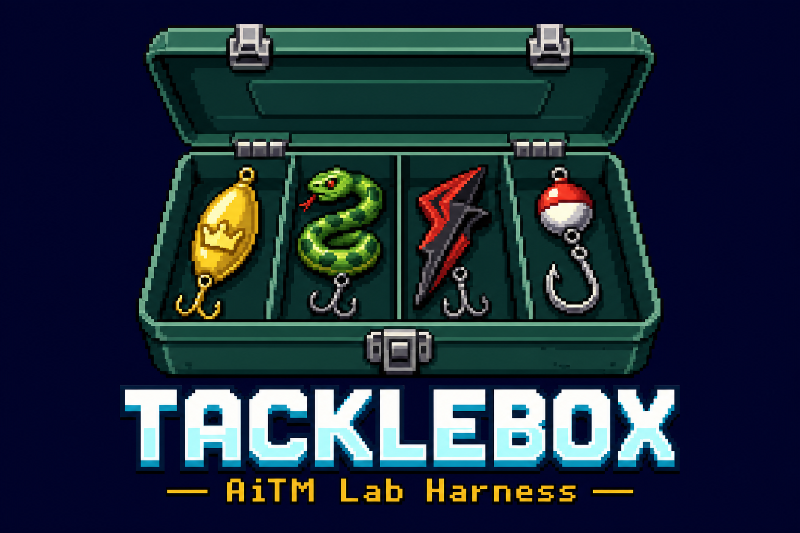

# Tacklebox

<p align="center">
  
</p>

> AiTM phishing kit emulation framework for M365 / Entra detection engineering.
> Every lure, every hook, every kit. One tacklebox.

Tacklebox emulates the post-authentication behavior of adversary-in-the-middle (AiTM) phishing kits — Tycoon 2FA, Mamba 2FA, EvilProxy, and others — against a labeled lab tenant, then verifies that expected telemetry actually appeared in Entra sign-in logs and the Unified Audit Log. It is the empirical-validation counterpart to the [Detection Chokepoints framework](https://iimp0ster.github.io/detection-chokepoints/): you run an atomic or rig, and Tacklebox tells you whether your detections would have fired. It is **lab-only and safety-gated by design**.

---

## Lab-only safety guard

**Do not run this framework against production tenants.**

`Test-TackleboxLab` is a mandatory pre-flight check that runs at every `Cast` and `Validate` invocation. It confirms the configured tenant is a labeled lab by checking one of three signals:

1. `tenant_id` appears in `lab_allow_list` in your config.
2. `tenant_name` matches `lab_pattern_regex` (default: `(?i)(lab|test|tacklebox-)`).
3. `tenant_id` itself matches the same pattern.

If no signal matches, the cmdlet throws and refuses to run. The escape hatch — setting `TACKLEBOX_LAB_OVERRIDE=1` and passing `-ConfirmOverride` — logs a prominent warning but still requires explicit opt-in on every invocation. It does not silently whitelist anything.

---

## Status

**v1 — working harness.** The full execution pipeline is implemented and the first wave of atomics and rig profiles is authored:

| Surface | What's shipped |
|---|---|
| **Cmdlets** | `Invoke-Tacklebox`, `Invoke-TackleboxRig`, `Get-Tackle`, `Get-TackleboxToken`, `Search-TackleboxTelemetry`, `Get-TackleboxCoverage`, `Test-TackleboxLab`, `Install-TackleboxDependencies`, `Show-TackleboxBanner` |
| **Atomics** | Initial set across T1078.001, T1078.004, T1087.004, T1098.005, T1114.002, T1114.003, T1213.002, T1528, T1534, T1539, T1550.001, T1566.002, T1621 |
| **Rigs** | Tycoon 2FA, Mamba 2FA, EvilProxy kit profiles |
| **Telemetry sources** | Entra sign-in logs, Unified Audit Log, Microsoft Graph directory audit, Exchange Online audit |

The project is still lab-focused and actively evolving. Cmdlet interfaces are stable for v1 but may change between minor versions.

---

## Quick start

### Prerequisites

- PowerShell 7.2+ (`pwsh`) on Windows, Linux, or macOS.
- Python 3 and `pipx` on your PATH (required for `roadtx`).
- An Entra ID lab tenant you own and control, with `AuditLog.Read.All` permissions for telemetry validation.
- `git` on your PATH.

### 1. Clone and import

```powershell
git clone https://github.com/iimp0ster/tacklebox.git
cd tacklebox
pwsh
Import-Module ./Tacklebox.psd1 -Force
```

On import the module displays the ASCII banner and warns if no lab tenant is configured. The banner can be suppressed by setting `$env:TACKLEBOX_NO_BANNER = '1'` before importing (useful in scripts and CI). The tenant warning is expected until you complete the next step.

### 2. Configure your lab tenant

Create `~/.tacklebox/config.json` (or `$env:TACKLEBOX_HOME/config.json`):

```json
{
  "tenant_id": "<lab-tenant-guid>",
  "tenant_name": "tacklebox-lab.onmicrosoft.com",
  "lab_allow_list": ["<lab-tenant-guid>"]
}
```

Confirm the guard passes before going further:

```powershell
Test-TackleboxLab
# Output: Tacklebox: tenant '<guid>' confirmed as lab (allow-list).
```

### 3. Install dependencies

Tacklebox wraps existing tools rather than reimplementing attack logic. Versions are pinned in [`dependencies/PINNED-VERSIONS.md`](dependencies/PINNED-VERSIONS.md). All installs are idempotent — running again when a tool is already at the pinned version is a no-op.

```powershell
# Install everything at once
Install-TackleboxDependencies -Component all

# Or install individual components
Install-TackleboxDependencies -Component roadtx                   # roadtools (pipx)
Install-TackleboxDependencies -Component microsoft.graph          # PowerShell Gallery
Install-TackleboxDependencies -Component exchangeonlinemanagement # PowerShell Gallery
Install-TackleboxDependencies -Component aadinternals             # PowerShell Gallery
```

`roadtx` requires `pipx`. If `pipx` is not on your PATH the cmdlet warns and skips that component; install `pipx` first (`pip install pipx`). The installer also pre-seeds `packaging` and `setuptools` into the roadtx venv so minimal Python environments don't fail at runtime.

### 4. Discover what's implemented

```powershell
# List all atomics
Get-Tackle | Format-Table Id, Technique, TestName, AuthProfile, Chokepoint

# List rig profiles
Get-TackleboxRig

# Print a Markdown coverage table across all atomics
Get-TackleboxCoverage -Format Markdown
```

### 5. Dry run an atomic

A dry run resolves all input arguments, substitutes template variables, and prints the planned command and expected telemetry — no network calls, no token-cache side effects.

```powershell
Invoke-Tacklebox -Atomic T1078.004-device-code -DryRun
```

The output shows: resolved command, input args, auth profile, expected telemetry entries (source, match criteria, polling budget), chokepoint id, and the auto-generated `RunId`.

### 6. Dry run a rig

Rigs chain multiple atomics into a full kill-chain profile. All steps share a single `RunId` so their logs and telemetry results tie together.

```powershell
Invoke-TackleboxRig -Rig tycoon -DryRun
```

### 7. Cast and validate (live lab run)

Once your lab tenant is confirmed and dependencies are installed:

```powershell
# Connect to Microsoft Graph for telemetry validation (needed for -Validate)
# Pass -TenantId explicitly to ensure the context is your Entra lab tenant,
# not a personal MSA account (which does not have access to sign-in logs).
Connect-MgGraph -TenantId <lab-tenant-guid> -Scopes 'AuditLog.Read.All'

# Pre-authenticate when an atomic declares requires_token
Get-TackleboxToken -AuthProfile device-code -TenantId <lab-tenant-guid>

# Execute and poll for expected telemetry (runs Test-TackleboxLab automatically)
Invoke-Tacklebox -Atomic T1078.004-device-code -Validate

# Run a full rig in validate mode
Invoke-TackleboxRig -Rig tycoon -Validate
```

Atomics that declare a `tenant_id` input argument automatically inherit the value from `~/.tacklebox/config.json` — no need to pass `-InputArgs @{tenant_id='...'}` explicitly. An explicit `-InputArgs` value always takes precedence if you need to override.

`-Validate` runs the atomic then calls `Search-TackleboxTelemetry` automatically. While polling, a `Write-Progress` bar displays the current expectation, source, and elapsed time so the run never looks hung. Polling continues until each `expected_telemetry` entry is matched or its `within_minutes` budget expires. You can also call `Search-TackleboxTelemetry` directly by `RunId` to re-query after the fact:

```powershell
Search-TackleboxTelemetry -RunId <guid>
```

> **Tenant licensing note.** `entra_signin` telemetry requires an Entra ID Premium P1 (or higher) license on the lab tenant. Without it, `Search-TackleboxTelemetry` will surface a `Authentication_RequestFromNonPremiumTenantOrB2CTenant` warning and mark those expectations as missed. The cast itself still succeeds and is logged. Activate a Microsoft 365 E5 developer trial on the tenant to enable the sign-in log API.

---

## Telemetry and coverage

### Run logs

Every cast writes a JSON Lines log to `~/.tacklebox/runs/<RunId>.jsonl`. Events include `cast-start`, `cast-end`, `telemetry-hit`, `telemetry-miss`, and `info`. Rig runs reuse a single `RunId` across all steps.

### Telemetry validation

`Search-TackleboxTelemetry` reads the `cast-start` event for a given `RunId`, recovers the `expected_telemetry` declarations, then queries the appropriate source for each one. Supported sources:

| Source | Backend |
|---|---|
| `entra_signin` | Microsoft Graph (`Get-MgAuditLogSignIn`) |
| `ual` | ExchangeOnlineManagement (`Search-UnifiedAuditLog`) |
| `graph_audit` | Microsoft Graph (`Get-MgAuditLogDirectoryAudit`) |
| `exo_audit` | ExchangeOnlineManagement (same as `ual`) |

Each expectation has a `within_minutes` polling budget. The cmdlet polls at 30-second intervals until the budget is exhausted or the event appears. Results are written back to the run log as `telemetry-hit` or `telemetry-miss`.

### Coverage report

```powershell
# Summary table in the console
Get-TackleboxCoverage

# Only chokepoints with confirmed telemetry hits in run logs
Get-TackleboxCoverage -Validated

# Markdown for pasting into reports or wikis
Get-TackleboxCoverage -Format Markdown
```

Coverage maps each atomic's `exercises_chokepoint` declaration to the chokepoints defined in the Detection Chokepoints framework. The `-Validated` flag filters to only chokepoints where a `telemetry-hit` event exists in `~/.tacklebox/runs/`, confirming the detection fired in a real lab run.

---

## Vocabulary

The fishing vocabulary is intentional and consistent throughout the codebase:

- **Atomics** are *tackle* — individual pieces of gear
- **Kit profiles** are *rigs* — assembled gear for a specific target
- **Chokepoint validation** is *checking your hooks* — confirming the gear works
- **Telemetry events** are the *bite* — proof the lure was taken

---

## Wrap-don't-write

Tacklebox is an orchestration and telemetry-validation framework, not an attack-research project. The majority of v1's executors wrap existing tools: `roadtx` (roadtools), TokenTacticsV2, GraphRunner, AADInternals, Microsoft.Graph SDK, ExchangeOnlineManagement. The framework's own code is the schema parser, token-chain resolver, telemetry harness, lab-safety enforcement, and chokepoint coverage reporter.

---

## Development

### Running the test suite

```powershell
# From the repo root
Invoke-Pester -Configuration (& ./tests/pester.config.ps1)
```

Tests use a temporary `TACKLEBOX_HOME` pointed at a scratch directory and set `TACKLEBOX_LAB_OVERRIDE=1` so they never touch a real tenant or token cache. `TACKLEBOX_NO_BANNER=1` is also set automatically by the Pester config to suppress the ASCII banner during test output. Output is `Detailed` by default and writes `TestResults.xml` (NUnit format) alongside `coverage.xml` (JaCoCo, disabled by default).

### Banner

The ASCII banner is displayed automatically on `Import-Module` in interactive sessions. Suppress it with:

```powershell
$env:TACKLEBOX_NO_BANNER = '1'
Import-Module ./Tacklebox.psd1 -Force
```

You can also call `Show-TackleboxBanner` directly, or use `-Compact` for narrow terminals:

```powershell
Show-TackleboxBanner           # full 80-column banner
Show-TackleboxBanner -Compact  # condensed ~65-column variant
```

The static pixel art logo lives at [`docs/assets/tacklebox-logo.png`](docs/assets/tacklebox-logo.png) and the plain-text banner source at [`docs/assets/tacklebox-banner.txt`](docs/assets/tacklebox-banner.txt).

### Linting

```powershell
Install-TackleboxDependencies -Component psscriptanalyzer
Invoke-ScriptAnalyzer -Path ./lib -Recurse
```

---

## License

License selection is pending v1 public release. Tacklebox is authored for **defensive detection engineering** — the goal is validating that your detections fire, not providing infrastructure for offensive operations. Dual-use disclosure details will be documented in `docs/` before public release.
